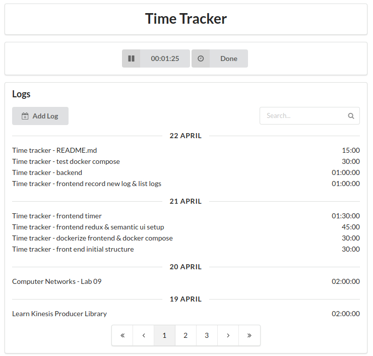

# Time Tracker

A simple time tracking application built with Spring MVC and ReactJS.



## Features

- Start a time to track your time
- Book time using timer or manually.
- List logs (also query by description)
- Dockerized :whale:

## Future Improvements

- Handle errors on UI. ie: Show an error message.
- Use `redux-localstorage`. So after starting timer, a user can close the tab.
- Tests (both API and frontend)
- Separate `actions/index.js` into two files. (same for `reducers/index.js`)
- Refactor `components/`.
- Disable `redux-logger` in production mode.
- More documentation

## Usage

### Prerequisites

- Docker (17.05 or higher)
- Docker compose

```bash
docker-compose up --detach
```

Open `http://localhost:8081` for web client.

## Development

### Modules

- [Web Client](web-client)
  - ReactJS application that was bootstrapped with 
  [Create React App](https://github.com/facebookincubator/create-react-app).
- [REST API](rest-api)
  - Spring MVC application with two endpoints (create & list)
  - Uses MongoDB (needs MONGO_URI environment variable)
- Mongo Seed
  - Creates sample data on MongoDB
  - You can disable it just deleting it from `docker-compose.yml`

### Prerequisites

- JDK 1.8+
- Maven 3+
- Node.js 8+
- npm 5+
- MongoDB 3+

```bash
# To run rest-api
cd rest-api/
MONGO_URI=mongodb://yourmongouri:port mvn spring-boot:run

# To run front-end in development mode
cd web-client/
npm install
npm start # It opens a tab (localhost:3000)
```

## Licence

[MIT. Copyright (C)](LICENSE) [Halil İbrahim Şener](http://halilsener.com).
